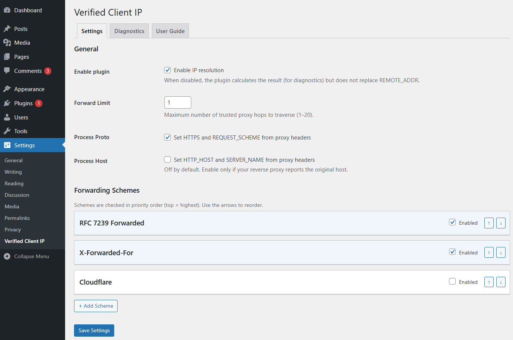
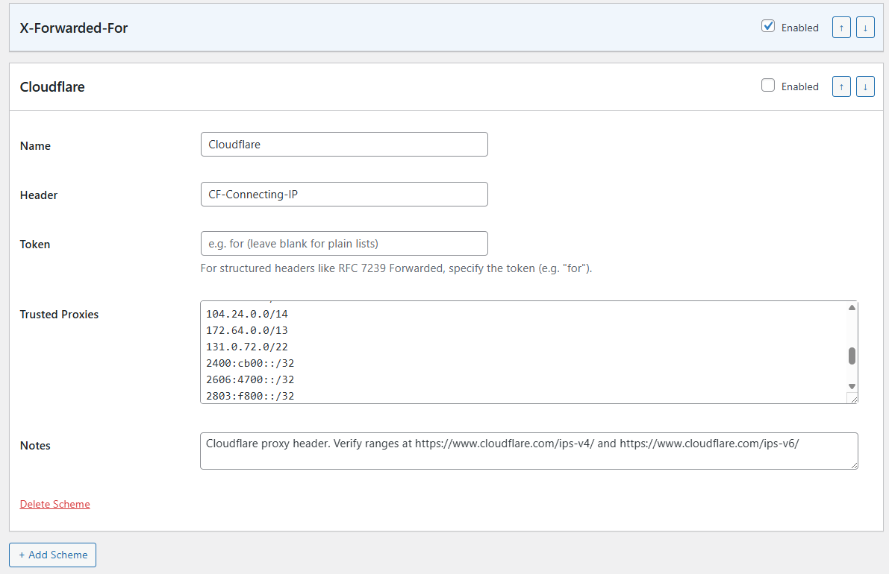
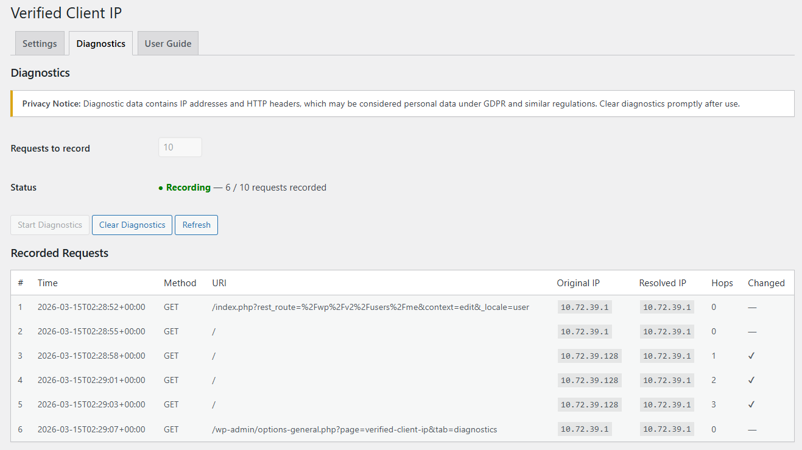
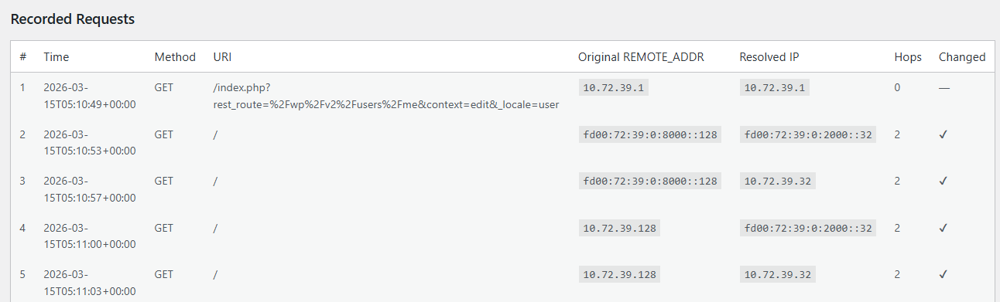
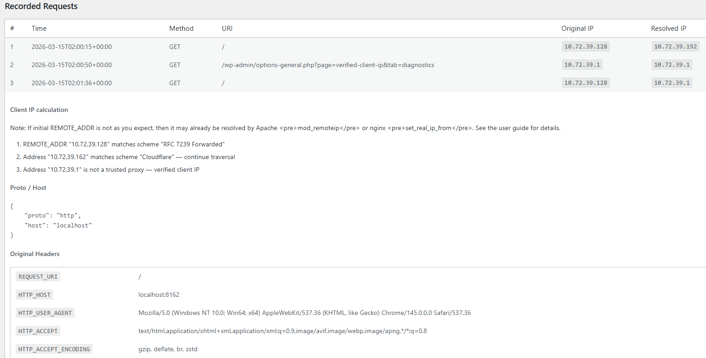
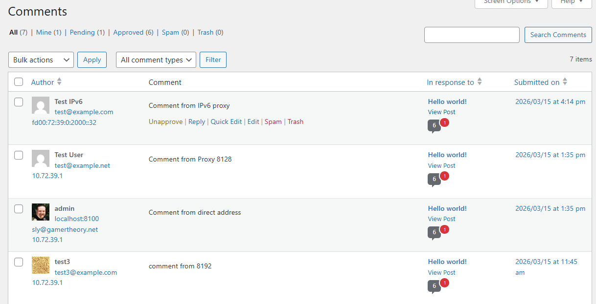

# Gryphon Verified Client IP

A WordPress plugin that determines the true client IP address by verifying
`Forwarded`, `X-Forwarded-For`, and similar headers, traversing only trusted
proxy hops. It replaces `$_SERVER['REMOTE_ADDR']` with the verified IP early
in the WordPress lifecycle, before any other plugin reads it.

## Why This Plugin?

When WordPress sits behind load balancers, CDNs, or reverse proxies,
`$_SERVER['REMOTE_ADDR']` contains the proxy's IP — not the real visitor's.
Many plugins solve this by blindly trusting forwarding headers, which is
**trivially spoofable**.

Gryphon Verified Client IP walks the forwarding chain **backwards**, only trusting
addresses that match your configured proxy networks (by CIDR range). It stops
at the first untrusted hop, which is the true client IP.

## Features

- **Secure by default** — only trusted proxies are traversed; spoofed headers
  are ignored.
- **Multiple header formats** — RFC 7239 `Forwarded`, `X-Forwarded-For`,
  Cloudflare `CF-Connecting-IP`, or custom headers.
- **IPv4 & IPv6** — full support including IPv4-mapped IPv6 normalisation.
- **Configurable forward limit** — control how many proxy hops to traverse.
- **Proto & Host processing** — optionally set `$_SERVER['HTTPS']` and
  `HTTP_HOST` from proxy headers.
- **Diagnostics** — record incoming requests with full header dumps and
  algorithm step traces for debugging.
- **WordPress hooks** — filters and actions for extensibility
  (`vcip_resolved_ip`, `vcip_trusted_proxies`, `vcip_ip_resolved`).
- **Must-use plugin support** — can run as a mu-plugin for earliest execution.

## Quick Start

1. Upload the `gryphon-verified-client-ip` folder to `wp-content/plugins/`.
2. Activate via **Plugins → Installed Plugins**.
3. Go to **Settings → Verified Client IP**.
4. Add your proxy's IP address or CIDR range to an enabled scheme.
5. Set the **Forward Limit** to the number of proxies in your chain.

## Documentation

- [User Guide](docs/user-guide.md) — configuration options, schemes, diagnostics
- [Development Guide](docs/development.md) — local setup, testing, code quality
- [Packaging Guide](docs/packaging.md) — building a distributable zip, WordPress submission
- [Examples Guide](examples/README.md) — local proxy chain testing environment

### Screenshots

**Main settings**

**Settings scheme detail**

**Diagnostics**

**IPv6 and protocol translation**

**Diagnostics detail**

**Comments with verified client IP**

## Compatibility Note

If your server uses **Apache `mod_remoteip`** or **nginx `set_real_ip_from`**,
those modules will pre-resolve `REMOTE_ADDR` from forwarding headers before
PHP runs. This means the plugin will see an already-resolved IP and become a
no-op. Disable the web server module and let this plugin handle IP resolution
instead. See the [User Guide](docs/user-guide.md#compatibility-with-apache-mod_remoteip-and-nginx-set_real_ip_from) for details.

## Requirements

- PHP 8.1 or later
- WordPress 6.4 or later

## License

GPLv2 or later. See [LICENSE](LICENSE) for details.
