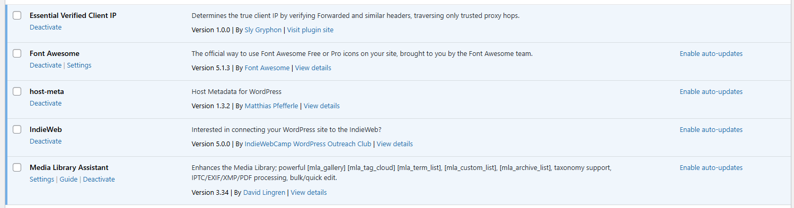

## Why

The WordPress Plugins page lists all installed plugins but provides no quick link to Gryphon Verified Client IP's settings or user guide. Administrators must navigate through the Settings menu to find the plugin's configuration. Adding "Settings" and "Guide" action links below the plugin name on the Plugins page (as is standard practice for WordPress plugins) improves discoverability and reduces clicks. See [GitHub issue #9](https://github.com/sgryphon/essential-wordpress-verified-client-ip/issues/9).

## What Changes

- Add a "Settings" action link on the Plugins page that navigates to the plugin's settings page (`admin.php?page=gryphon-verified-client-ip`).
- Add a "Guide" action link on the Plugins page that navigates to the User Guide tab (`admin.php?page=gryphon-verified-client-ip&tab=user-guide`).
- Register a `plugin_action_links_{plugin_basename}` filter to inject these links.

### Screen shot

- Screen shot showing similar links for other plugins: 

## Capabilities

### New Capabilities

- `plugin-action-links`: Adds Settings and Guide shortcut links to the plugin's row on the WordPress Plugins page.

### Modified Capabilities

_(none — the existing `plugin-identity` spec is unaffected; this is purely additive UI)_

## Impact

- **Code**: `gryphon-verified-client-ip.php` or `src/AdminPage.php` — one new filter registration and callback.
- **APIs**: No public API changes. Uses the standard WordPress `plugin_action_links_{basename}` filter.
- **Dependencies**: None.
- **Testing**: New integration test to verify the filter produces the expected links.
